### `soufiane@github ~ $ ./contributions.sh`

 

### `soufiane@github ~ $ whoami`

 

 

### `soufiane@github ~ $ ./links.sh`

**SOUFIANE ZIANI**

Software Developer · Flutter Developer · Backend Systems · APIs · Automation

Daily GitHub data · UTC calendar · Streaks measured within the displayed 365-day window

About these terminal cards

The cards use live GitHub data for the displayed 365 UTC dates. Current streak
includes yesterday when today has no contributions yet; longest streak is limited
to this window. Repository and card star totals cover public, non-fork repositories.
See [generation and maintenance](docs/profile-art.md) for details.

